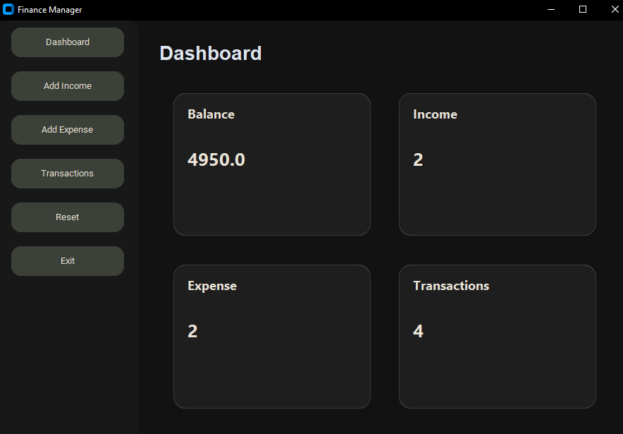
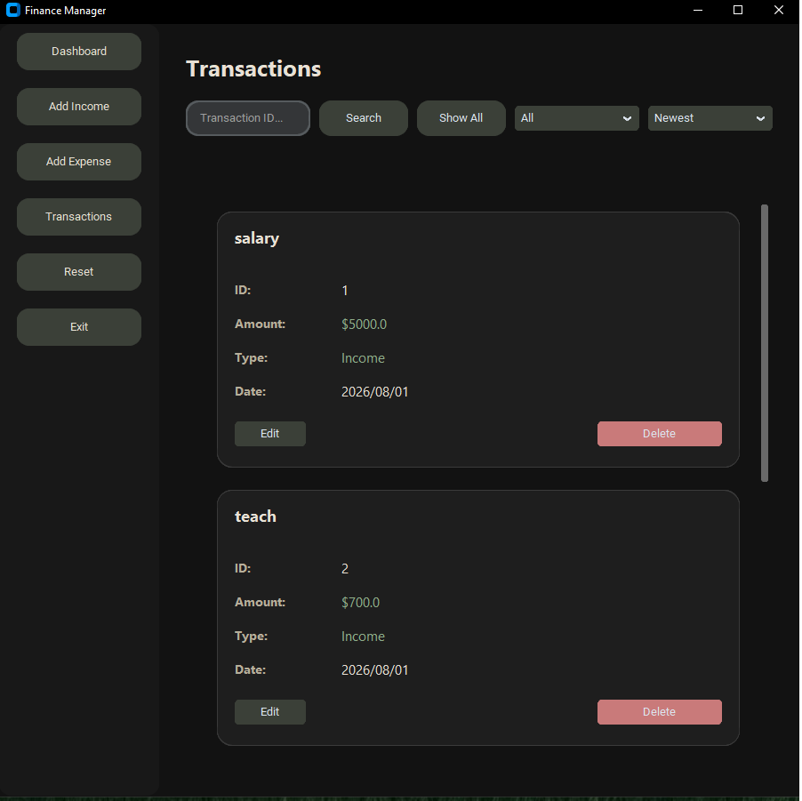
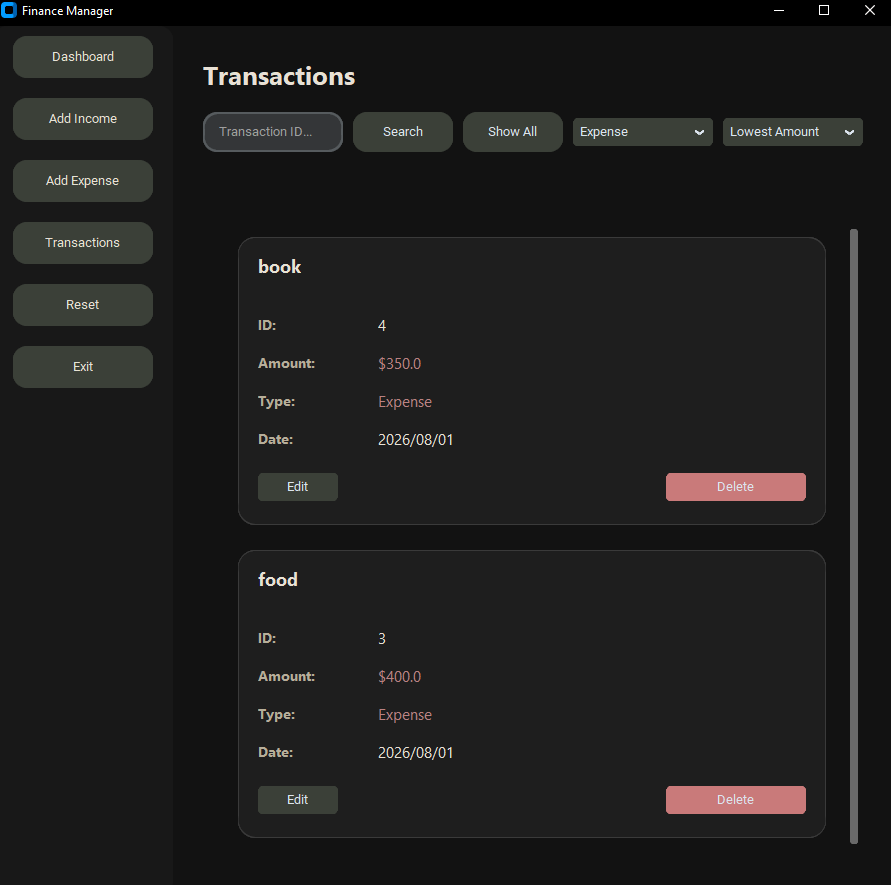

# Personal Finance Manager

A desktop application for managing personal income and expenses.


## Screenshots

### Dashboard


### Transactions



### Edit page
1[Edit](images/44.png)


## Features

- Add income transactions
- Add expense transactions
- Edit transactions
- Delete transactions
- Search transactions by ID
- Filter transactions by type
- Sort transactions by:
  - Newest
  - Oldest
  - Highest amount
  - Lowest amount
- Track current balance
- Reset all data
- Save data using CSV file

## Technologies

- Python
- CustomTkinter
- CSV

## Installation

Clone the repository:

```bash
git clone https://github.com/AlirezaAmiri01/Personal-Finance-Manager.git
```

pip install -r requirements.txt


## Run the app

python main.py


## Project Structure

The application stores transactions in a CSV file.
Each transaction contains:
- ID
- Title
- Amount
- Type
- Creation date
- Future Improvements
- Add financial charts and reports
- Add more advanced filters
- Improve user interface
- Add database support
- Add export and import features